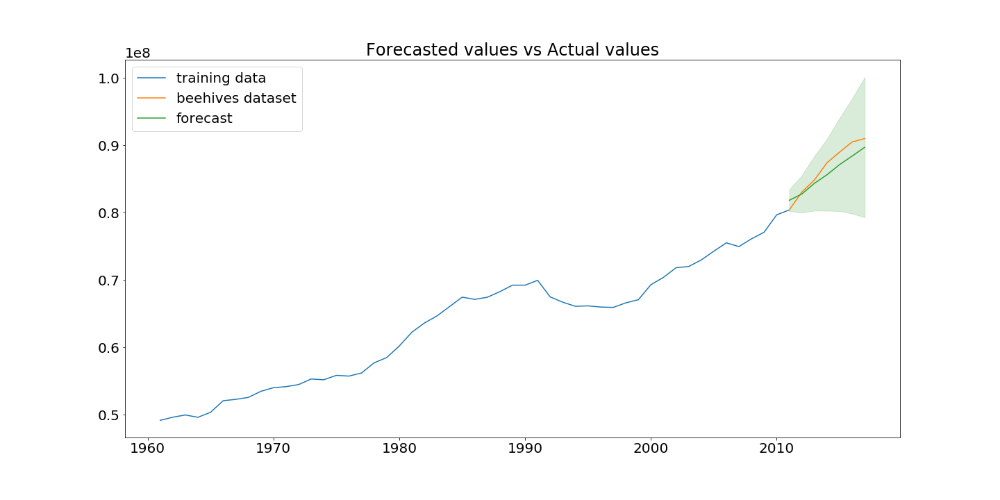

## Predictions

### Future forecasting
What will the future trend of beehives be like? We analyzed the dataset so far and noticed a steady increase since 1960. The future could look similar. We used the whole time series to predict the future of beehives until 2030 and see it will be increasing even more. But the future is not set in stone. We saw a massive decrease of beehives in Europe and in the US between 1990 and 2000. This can happen anywhere and at any time. A lot of unpredictable factors and uncertainties influence beehive colonies. 

For predicting the future we use Auto Regressive Integrated Moving Average ([ARIMA](https://en.wikipedia.org/wiki/Autoregressive_integrated_moving_average "ARIMA")) and evaluate first using the original data for the range of 2010 until 2017. This is how our evaluation looks like. Quite similar, right? 

Let us now move further and predict the value until 2030. 

This is giving us a positive outlook for the future of bees.

### Prediction based on crops
American Beekeping Federation indicates that honey bees contribute nearly $20 billion to the value of U.S. crop production. As they state on their website: "This contribution, made by managed honey bees, comes in the form of increased yields and superior quality crops for growers and American consumers". After seeing this we decided to try and make prediciton about the number of beehives from the information about the crops production and the size of the area of a country and production yields. Our idea was to make a model which could be used as a recommender system for farmers. The input for the prediction model would be the size of the agricultural area and how much crops production would you like to have and the model would make a prediction about how many beehives you need on your farm. Unfortunately, this is a complex problem and the data wasn't good enough to make a meaningful prediction. Anyway, we see this as something which could be done in future work.