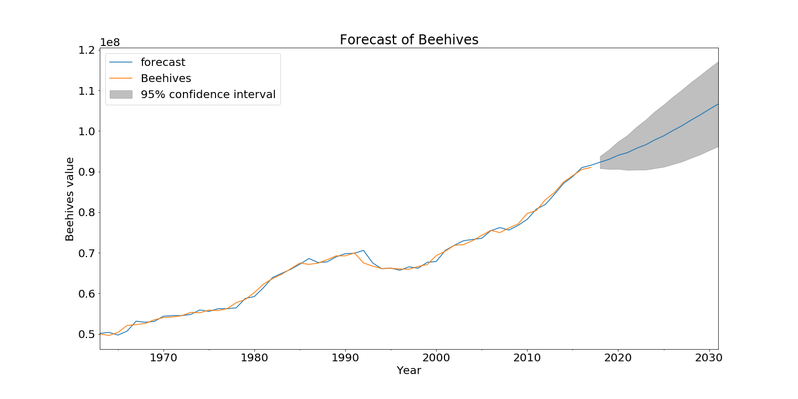

## Predictions
What will the future trend of beehives be like? We analyzed the dataset so far and noticed a steady increase since 1960. The future could look similar. We used the whole time series to predict the future of beehives until 2030 and see it will be increasing even more. But the future is not set in stone. We saw a massive decrease of beehives in Europe and in the US between 1990 and 2000. This can happen anywhere and at any time. A lot of unpredictable factors and uncertainties influence beehive colonies. 

