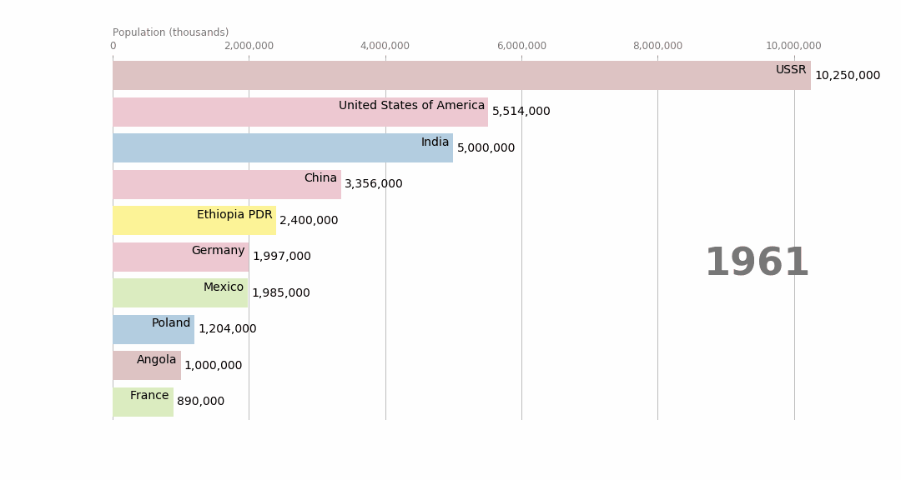

## Conclusions
In our project we answered several questions using different datasets. During the process we were surprised to disprove the common belief of beehives dying out. It was even possible to give a positive future if the trend continues. Nonetheless this is not true for every country. Especially in some european countries bee population is still declining. We found out that bee colonies are not equally distributed and that a small portion of countries is responsible for most of the beehives and further showed a correlation between beehives and crops. To do all this, we needed to explore various datasets and even talk to experts in the field. We hope you find this story interesting and informative!

 ------

We would like to conclude the story with a nice racing bar plot for all the gif lovers. Here we present to you a race for the highest number of beehives in the World from 1961 to 2017. 

